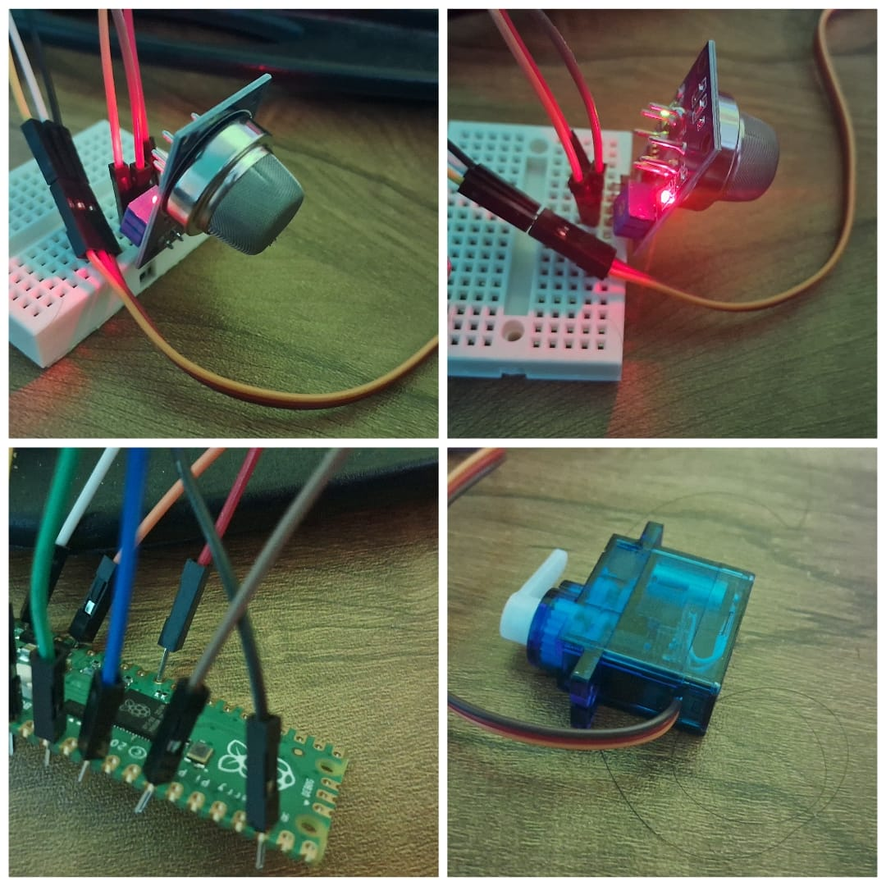

# Project using Pi
<h1>A Smoke/Particulate detection device which will turn the actuators when particulate matter is detected</h1>

# Devices used

<ul>
  <li>LED</li>
  <li>Raspberry Pi Pico</li>
  <li>Servo Motor</li>
  <li>MQ-2 Gas Sensor</li>
  <li>Jumpers & Breadbaords</li>
</ul>

# Results

